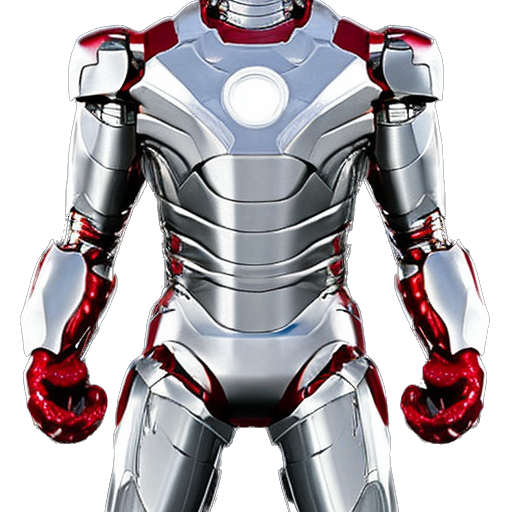
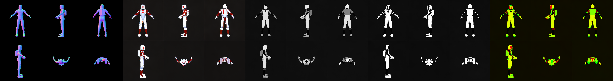

# Multi-view PBR Material Diffusion Model (MV-PBRMat-Diffusion)
PyTorch implementation of Multi-view PBR Material Diffusion Model, a small step towards the reproduction of [CLAY](https://sites.google.com/view/clay-3dlm)-like material synthesis architecture.

## [Weights]() | [Project Page]()

## 🎸 Install for inference
- You can install the required dependencies via *requirements-inference.txt*.
```bash
pip install -r requirements-inference.txt
```

- (Optional) You can also install PyTorch at first via [PyTorch Official](https://pytorch.org/get-started/previous-versions/), then install other dependencies via *requirements-inference.txt*.
```bash
# CUDA 11.6
conda install pytorch==1.13.1 torchvision==0.14.1 torchaudio==0.13.1 pytorch-cuda=11.6 -c pytorch -c nvidia

# remember to remove packages related to torch
pip install -r requirements-inference.txt
```

## 🎹 Run inference
- You can regard *run.sh* as an example.
```bash
# in run.sh

python inference.py --ctrlnet_seed=42 --mvdiff_seed=42 \ # seeds for normal-conditioned ControlNet and Multi-view PBR Diffusion
    --controlnet_cond_mode="image" \ # normal-conditioned ControlNet can take a text/image prompt as input, "text" for text prompt, "image" for image prompt
    --prompt="/path/to/image_prompt.png" \ # if controlnet_cond_mode=="text", input text prompt. if controlnet_cond_mode=="image", input /path/to/image
    --controlnet_normal_path="/path/to/front_normal.png" \ # normal condition for ControlNet, recommend to use the front view normal of the untextured mesh
    --input_path="/path/to/multi_view_normals_folder" \ # the folder should contain 6-view normals: front.png, right.png, back.png, left.png, top.png, bottom.png
    --out_path="/path/to/inference_results" \ # output path
    --do_mv_super_res # whether do multi-view super-resolution or not
```
- Run *run.sh* for inference
```bash
bash run.sh
```

## 🎻 Visualization
### Example 1
- Image prompt



- Multi-view PBR material generation results



## 💎 Acknowledgments
- [CLAY: A Controllable Large-scale Generative Model for Creating High-quality 3D Assets](https://sites.google.com/view/clay-3dlm)
- [MVDream: Multi-view Diffusion for 3D Generation](https://mv-dream.github.io/)
- [Controllable Text-to-3D Generation via Surface-Aligned Gaussian Splatting](https://lizhiqi49.github.io/MVControl/)
- [IP-Adapter: Text Compatible Image Prompt Adapter for Text-to-Image Diffusion Models](https://ip-adapter.github.io/)
- [HyperHuman: Hyper-Realistic Human Generation with Latent Structural Diffusion](https://snap-research.github.io/HyperHuman/)
- [Objaverse: A Universe of Annotated 3D Objects](https://objaverse.allenai.org/)
- [G-buffer Objaverse: High-Quality Rendering Dataset of Objaverse](https://aigc3d.github.io/gobjaverse/)
- [Material Anything: Generating Materials for Any 3D Object via Diffusion](https://xhuangcv.github.io/MaterialAnything/)